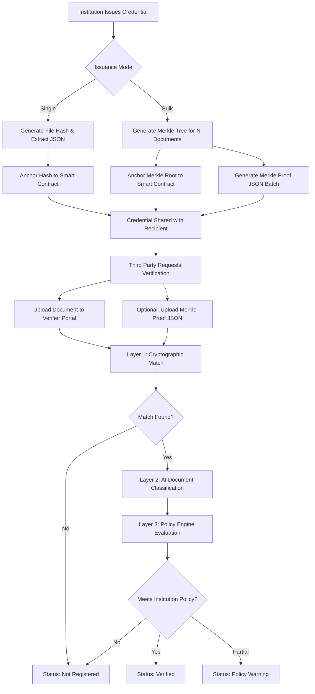

# Trustless Attestation Protocol (TAP)

The Trustless Attestation Protocol (TAP) is a decentralized, cryptographically secure credential issuance and verification architecture. Built upon the principles of zero-trust verification, the system anchors document integrity to the blockchain while utilizing an AI advisory layer to classify, parse, and evaluate physical and digital credentials against institution-defined strictness policies.

## Architectural Overview

The system operates across three fundamental layers to ensure document authenticity, data extraction accuracy, and policy compliance:

1. **Cryptographic Anchoring (Layer 1)**
   Ensures the mathematical immutability of the credential. Documents are hashed (SHA-256) at the byte level or data level and anchored to a smart contract via Merkle Trees for bulk issuance or direct state updates for single issuance.
   
2. **AI Advisory Interface (Layer 2)**
   Utilizes a deterministic AI model to parse document contents, extract structured metadata, and classify the physical nature of the artifact (e.g., distinguishing between a pristine digital original, a physical photocopy, or a digital photograph of a screen).

3. **Policy Engine (Layer 3)**
   Evaluates the cryptographic proof and AI advisory metadata against an institutionally defined Verification Policy, determining if the presented artifact meets the required strictness thresholds for acceptance.

## System Workflow Diagram



## Primary Use Cases by Institution Type

The flexible policy engine allows different entities to configure verification thresholds suited to their specific security requirements and risk profiles.

### 1. Academic Institutions (Universities, Examination Boards)
**Policy Profile:** High Strictness
**Use Case:** Issuing digital degrees and transcripts. The university configures policies requiring exact cryptographic matches of original digital PDFs. Photocopies or images of degrees are flagged with a Policy Warning or rejected to prevent tampering, ensuring transferring universities or employers receive the unadulterated original document.

### 2. Corporate HR & Employment Verification
**Policy Profile:** Medium Strictness
**Use Case:** Verifying incoming employee certifications (e.g., AWS, Cisco) or previous employment letters. HR departments may configure the Policy Engine to accept physical photocopies or scans, provided the AI confidence score remains above a defined threshold and the underlying data hash matches the issuing organization's on-chain record.

### 3. Government & Regulatory Bodies
**Policy Profile:** Maximum Strictness
**Use Case:** Issuing operational licenses, visas, or compliance certificates. The protocol can utilize Merkle batch issuance to process thousands of licenses daily with a single blockchain transaction. Verification requires exact byte-matching, rejecting any form of digital reproduction or physical copying to eliminate forgery in high-stakes regulatory environments.

### 4. Healthcare Providers
**Policy Profile:** Custom Strictness
**Use Case:** Attesting to medical training, lab certifications, or continuing medical education (CME) credits. Bulk issuance allows medical boards to update credentials for practitioners seamlessly, while hospitals verifying the credentials can utilize the AI layer to parse the specific dates and specialized training fields for automated compliance tracking.

## Technical Stack

- **Frontend:** Next.js (React), Tailwind CSS
- **Smart Contracts:** Solidity, Hardhat
- **Blockchain Interface:** Wagmi, Ethers.js
- **AI Integration:** Google Generative AI (Gemini)
- **Cryptography:** Web Crypto API (SHA-256), Merkle Trees

## Deployment & Setup

The application is structured for deployment on serverless architectures such as Vercel. The environment requires the configuration of the following variables:

- `NEXT_PUBLIC_GEMINI_API_KEY`: API key for the AI Advisory layer.
- `NEXT_PUBLIC_DASHBOARD_CONTRACT_ADDRESS`: The deployed address of the Attestation Registry smart contract.
- `NEXT_PUBLIC_WALLETCONNECT_PROJECT_ID`: Configuration for the Web3 modal provider.

```bash
# Install dependencies
npm install

# Start development server
npm run dev
```
